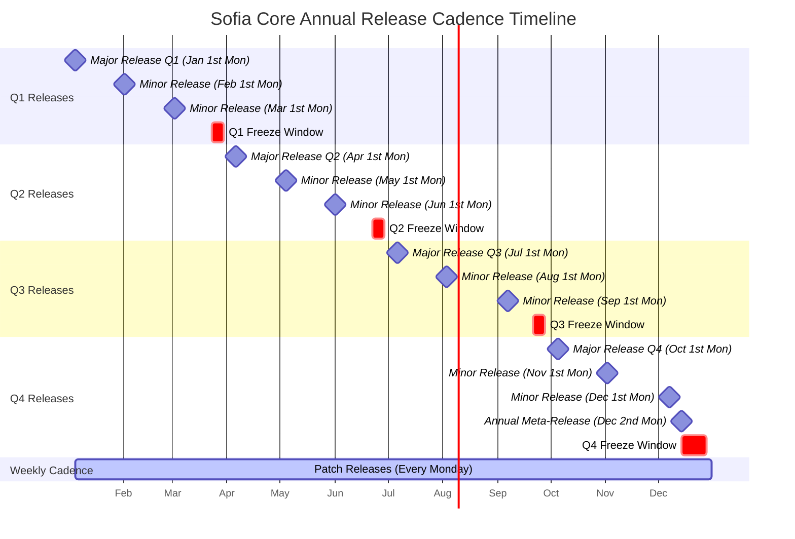
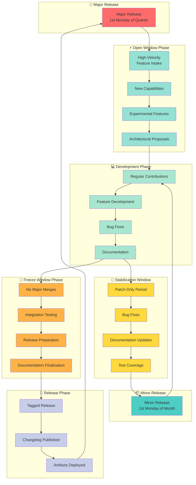
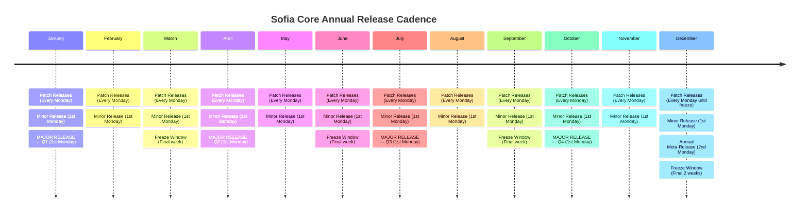

# Annual Release Cadence for Sofia Core

**Applies to:** Sofia Core, EmeraldOrbit, Emerald Estates, EWF, and SEFAA

## Table of Contents

- [Overview](#-overview)
- [Badges](#-badges)
- [Release Types](#-release-types)
- [Annual Release Gantt Chart](#-annual-release-gantt-chart)
- [Visual Calendar Layout](#️-visual-calendar-layout)
- [Contributor Windows](#-contributor-windows)
- [Contributor Workflow Process](#-contributor-workflow-process)
- [Governance Sync Points](#-governance-sync-points)
- [Mermaid Timeline View](#-mermaid-timeline-view)
- [Release Intensity Heatmap](#-release-intensity-heatmap)
- [Purpose](#-purpose)
- [Quick Reference](#-quick-reference)

## 📅 Overview

This document defines the predictable annual rhythm for patch, minor, and major releases.

This cadence ensures:
- **Stability** — Consistent, reliable release patterns
- **Contributor clarity** — Predictable windows for contributions
- **Roadmap alignment** — Synchronized with architectural milestones
- **Unified‑field coherence** — Identity-preserving evolution
- **Zero‑surprise evolution** — Planned, ceremonial change management

All dates use a **Monday‑based cadence** for maximum contributor clarity.

---

## 🏷️ Badges


---

## 🔄 Release Types

### 1. Patch Releases — Weekly

**Schedule:** Every Monday

**Purpose:**
- Bug fixes
- Stability improvements
- Documentation updates
- Small internal refinements

This keeps the field clean and responsive without disrupting larger cycles.

### 2. Minor Releases — Monthly

**Schedule:** First Monday of every month

**Purpose:**
- New features
- New identity behaviors
- Non‑breaking enhancements
- Module‑level improvements

This gives contributors a predictable window to target.

### 3. Major Releases — Quarterly

**Schedule:** First Monday of January, April, July, October

**Purpose:**
- Breaking changes
- Structural shifts
- New identity layers
- Runtime redesigns
- Architectural evolution

This aligns with roadmap phases and ensures major changes land with ceremony and preparation.

### 4. Annual Meta‑Release — December

**Schedule:** Second Monday of December

**Purpose:**
- Year‑end consolidation
- Documentation harmonization
- Deprecations
- Long‑term roadmap reset
- Unified‑field alignment review

This is the "architectural audit" moment — the field's annual reset.

---

## 📊 Annual Release Gantt Chart

This Gantt chart visualizes the complete annual release schedule, showing the relationship between different release types and key windows throughout the year:



**Key Elements:**
- **Major Releases** (Milestones) — Quarterly on 1st Monday of Jan, Apr, Jul, Oct
- **Minor Releases** (Milestones) — Monthly on 1st Monday
- **Annual Meta‑Release** (Milestone) — 2nd Monday of December
- **Freeze Windows** (Red/Critical) — Last week of Q1-Q3, final 2 weeks of Q4
- **Patch Releases** (Active bar) — Continuous weekly rhythm every Monday

---

## 🗓️ Visual Calendar Layout

```
┌──────────────────────────────────────────────────────────────┐
│                        ANNUAL RELEASE MAP                     │
└──────────────────────────────────────────────────────────────┘

JANUARY
  ├─ Patch Releases: Every Monday
  ├─ Minor Release: 1st Monday
  └─ MAJOR RELEASE (Q1): 1st Monday

FEBRUARY
  ├─ Patch Releases: Every Monday
  └─ Minor Release: 1st Monday

MARCH
  ├─ Patch Releases: Every Monday
  ├─ Minor Release: 1st Monday
  └─ Freeze Window: Final week (Q1 end)

APRIL
  ├─ Patch Releases: Every Monday
  ├─ Minor Release: 1st Monday
  └─ MAJOR RELEASE (Q2): 1st Monday

MAY
  ├─ Patch Releases: Every Monday
  └─ Minor Release: 1st Monday

JUNE
  ├─ Patch Releases: Every Monday
  ├─ Minor Release: 1st Monday
  └─ Freeze Window: Final week (Q2 end)

JULY
  ├─ Patch Releases: Every Monday
  ├─ Minor Release: 1st Monday
  └─ MAJOR RELEASE (Q3): 1st Monday

AUGUST
  ├─ Patch Releases: Every Monday
  └─ Minor Release: 1st Monday

SEPTEMBER
  ├─ Patch Releases: Every Monday
  ├─ Minor Release: 1st Monday
  └─ Freeze Window: Final week (Q3 end)

OCTOBER
  ├─ Patch Releases: Every Monday
  ├─ Minor Release: 1st Monday
  └─ MAJOR RELEASE (Q4): 1st Monday

NOVEMBER
  ├─ Patch Releases: Every Monday
  └─ Minor Release: 1st Monday

DECEMBER
  ├─ Patch Releases: Every Monday (until freeze)
  ├─ Minor Release: 1st Monday
  ├─ Annual Meta‑Release: 2nd Monday
  └─ Freeze Window: Final 2 weeks (Q4 end)
```

---

## 🔁 Contributor Windows

To support the cadence, we define three key contributor windows:

### Open Window
- **When:** First 2 weeks after each major release
- **Activity:** High‑velocity feature intake
- **Focus:** New capabilities, experimental features, architectural proposals

### Stabilization Window
- **When:** Final week before each minor release
- **Activity:** Patch‑only
- **Focus:** Bug fixes, documentation, test coverage

### Freeze Window
- **When:** Last week of Q1-Q3 quarters; final 2 weeks of Q4/December
- **Activity:** No major merges
- **Focus:** Integration testing, release preparation, documentation finalization
- **Note:** December has a 2-week freeze to accommodate the annual meta-release and year-end consolidation

---

## 🔀 Contributor Workflow Process

This swimlane diagram illustrates the contributor workflow across different release phases, showing when and how to contribute throughout the release cycle:



**Workflow Phases Explained:**

1. **Major Release** — Quarterly major release kicks off new cycle
2. **Open Window** (2 weeks) — High-velocity period for ambitious contributions
3. **Development Phase** — Regular contribution period with normal velocity
4. **Stabilization Window** (1 week) — Patch-only period before minor releases
5. **Minor Release** — Monthly feature release (or continue to freeze for quarter-end)
6. **Freeze Window** — Quarter-end integration testing and release prep
7. **Release Phase** — Tagged release with artifacts

**Contributor Guidance:**
- **Want to add major features?** → Target the Open Window after major releases
- **Want to contribute regularly?** → Development Phase is open for all contributions
- **Found a bug?** → Patches welcome anytime, especially in Stabilization Windows
- **Quarter ending soon?** → Be aware of Freeze Window—major work should wait

---

## 🧭 Governance Sync Points

### Monthly Maintainer Sync
- Review roadmap
- Triage issues
- Confirm next minor release
- Identity coherence check

### Quarterly Architecture Review
- Evaluate module boundaries
- Review runtime behavior
- Assess identity coherence
- Plan major release content

### Annual Unified‑Field Review
- Confirm long‑term direction
- Evolution phase confirmation
- Architectural audit
- Year‑end consolidation

---

## 📊 Mermaid Timeline View



---

## 🔥 Release Intensity Heatmap

This visualization shows the relative intensity of release activity throughout the year:

> **Note:** This heatmap uses emoji symbols for visual clarity. For best viewing, use a markdown viewer that supports emoji rendering.

| Release Type | Jan | Feb | Mar | Apr | May | Jun | Jul | Aug | Sep | Oct | Nov | Dec |
|--------------|-----|-----|-----|-----|-----|-----|-----|-----|-----|-----|-----|-----|
| **Patch**    | 🟦🟦🟦🟦 | 🟦🟦🟦🟦 | 🟦🟦🟦🟦 | 🟦🟦🟦🟦 | 🟦🟦🟦🟦 | 🟦🟦🟦🟦 | 🟦🟦🟦🟦 | 🟦🟦🟦🟦 | 🟦🟦🟦🟦 | 🟦🟦🟦🟦 | 🟦🟦🟦🟦 | 🟦🟦🟦🟦 |
| **Minor**    | 🟩 | 🟩 | 🟩 | 🟩 | 🟩 | 🟩 | 🟩 | 🟩 | 🟩 | 🟩 | 🟩 | 🟩 |
| **Major**    | 🟧 | ⬜ | ⬜ | 🟧 | ⬜ | ⬜ | 🟧 | ⬜ | ⬜ | 🟧 | ⬜ | ⬜ |
| **Meta**     | ⬜ | ⬜ | ⬜ | ⬜ | ⬜ | ⬜ | ⬜ | ⬜ | ⬜ | ⬜ | ⬜ | 🟥 |
| **Freeze**   | ⬜ | ⬜ | 🟨 | ⬜ | ⬜ | 🟨 | ⬜ | ⬜ | 🟨 | ⬜ | ⬜ | 🟨🟨 |

**Legend:**
- 🟦 Patch releases (every Monday)
- 🟩 Minor release (1st Monday)
- 🟧 Major release (Quarterly, 1st Monday)
- 🟥 Annual Meta‑Release (2nd Monday of December)
- 🟨 Freeze Window (1 week at end of Q1-Q3, 2 weeks at end of Q4/December - note the double 🟨🟨 in December column)
- ⬜ No activity

### How to read this heatmap:
- **Patch (🟦🟦🟦🟦)** → Weekly cadence, always active
- **Minor (🟩)** → First Monday of the month
- **Major (🟧)** → First Monday of each quarter (Jan, Apr, Jul, Oct)
- **Meta (🟥)** → Second Monday of December
- **Freeze (🟨)** → Final week of Q1-Q3 quarters, final 2 weeks of Q4/December

The heatmap gives contributors and maintainers a single‑glance understanding of the entire year's rhythm.

---

## 🎯 Purpose

This calendar establishes a predictable, stable, identity‑aligned release rhythm across all systems governed by the unified field.

**Key Benefits:**
- **Predictable contributor flow** — Everyone knows when to contribute
- **Stable evolution** — Changes land at expected intervals
- **Coherent architectural progression** — Major shifts are planned and ceremonial
- **Unified‑field integrity** — All systems evolve together
- **Zero‑surprise governance** — Changes are telegraphed and prepared

This cadence is designed to support Sofia Core, EmeraldOrbit, Emerald Estates, EWF, and SEFAA governance structures while maintaining the unified field's identity coherence.

---

## 📝 Quick Reference

| Release Type | Frequency | Day | Purpose |
|--------------|-----------|-----|---------|
| Patch | Weekly | Every Monday | Bug fixes, stability |
| Minor | Monthly | 1st Monday | Features, enhancements |
| Major | Quarterly | 1st Monday (Jan, Apr, Jul, Oct) | Breaking changes, architectural shifts |
| Meta | Annually | 2nd Monday of December | Year‑end consolidation |

**Contributor Windows:**
- **Open:** 2 weeks after major releases
- **Stabilization:** 1 week before minor releases
- **Freeze:** Last week of Q1-Q3 quarters (2 weeks in Q4/December)

**Governance Sync:**
- **Monthly:** Maintainer sync
- **Quarterly:** Architecture review
- **Annually:** Unified‑field review
