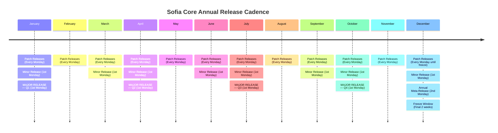

# Annual Release Cadence for Sofia Core

**Applies to:** Sofia Core, EmeraldOrbit, Emerald Estates, EWF, and SEFAA

## 📅 Overview

This document defines the predictable annual rhythm for patch, minor, and major releases.

This cadence ensures:
- **Stability** — Consistent, reliable release patterns
- **Contributor clarity** — Predictable windows for contributions
- **Roadmap alignment** — Synchronized with architectural milestones
- **Unified‑field coherence** — Identity-preserving evolution
- **Zero‑surprise evolution** — Planned, ceremonial change management

All dates use a **Monday‑based cadence** for maximum contributor clarity.

---

## 🔄 Release Types

### 1. Patch Releases — Weekly

**Schedule:** Every Monday

**Purpose:**
- Bug fixes
- Stability improvements
- Documentation updates
- Small internal refinements

This keeps the field clean and responsive without disrupting larger cycles.

### 2. Minor Releases — Monthly

**Schedule:** First Monday of every month

**Purpose:**
- New features
- New identity behaviors
- Non‑breaking enhancements
- Module‑level improvements

This gives contributors a predictable window to target.

### 3. Major Releases — Quarterly

**Schedule:** First Monday of January, April, July, October

**Purpose:**
- Breaking changes
- Structural shifts
- New identity layers
- Runtime redesigns
- Architectural evolution

This aligns with roadmap phases and ensures major changes land with ceremony and preparation.

### 4. Annual Meta‑Release — December

**Schedule:** Second Monday of December

**Purpose:**
- Year‑end consolidation
- Documentation harmonization
- Deprecations
- Long‑term roadmap reset
- Unified‑field alignment review

This is the "architectural audit" moment — the field's annual reset.

---

## 🗓️ Visual Calendar Layout

```
┌──────────────────────────────────────────────────────────────┐
│                        ANNUAL RELEASE MAP                     │
└──────────────────────────────────────────────────────────────┘

JANUARY
  ├─ Patch Releases: Every Monday
  ├─ Minor Release: 1st Monday
  └─ MAJOR RELEASE (Q1): 1st Monday

FEBRUARY
  └─ Patch Releases: Every Monday

MARCH
  ├─ Patch Releases: Every Monday
  └─ Minor Release: 1st Monday

APRIL
  ├─ Patch Releases: Every Monday
  ├─ Minor Release: 1st Monday
  └─ MAJOR RELEASE (Q2): 1st Monday

MAY
  └─ Patch Releases: Every Monday

JUNE
  ├─ Patch Releases: Every Monday
  └─ Minor Release: 1st Monday

JULY
  ├─ Patch Releases: Every Monday
  ├─ Minor Release: 1st Monday
  └─ MAJOR RELEASE (Q3): 1st Monday

AUGUST
  └─ Patch Releases: Every Monday

SEPTEMBER
  ├─ Patch Releases: Every Monday
  └─ Minor Release: 1st Monday

OCTOBER
  ├─ Patch Releases: Every Monday
  ├─ Minor Release: 1st Monday
  └─ MAJOR RELEASE (Q4): 1st Monday

NOVEMBER
  └─ Patch Releases: Every Monday

DECEMBER
  ├─ Patch Releases: Every Monday (until freeze)
  ├─ Minor Release: 1st Monday
  ├─ Annual Meta‑Release: 2nd Monday
  └─ Freeze Window: Final 2 weeks
```

---

## 🔁 Contributor Windows

To support the cadence, we define three key contributor windows:

### Open Window
- **When:** First 2 weeks after each major release
- **Activity:** High‑velocity feature intake
- **Focus:** New capabilities, experimental features, architectural proposals

### Stabilization Window
- **When:** Final week before each minor release
- **Activity:** Patch‑only
- **Focus:** Bug fixes, documentation, test coverage

### Freeze Window
- **When:** Last week of each quarter
- **Activity:** No major merges
- **Focus:** Integration testing, release preparation, documentation finalization

---

## 🧭 Governance Sync Points

### Monthly Maintainer Sync
- Review roadmap
- Triage issues
- Confirm next minor release
- Identity coherence check

### Quarterly Architecture Review
- Evaluate module boundaries
- Review runtime behavior
- Assess identity coherence
- Plan major release content

### Annual Unified‑Field Review
- Confirm long‑term direction
- Evolution phase confirmation
- Architectural audit
- Year‑end consolidation

---

## 📊 Mermaid Timeline View



---

## 🔥 Release Intensity Heatmap

This visualization shows the relative intensity of release activity throughout the year:

| Release Type | Jan | Feb | Mar | Apr | May | Jun | Jul | Aug | Sep | Oct | Nov | Dec |
|--------------|-----|-----|-----|-----|-----|-----|-----|-----|-----|-----|-----|-----|
| **Patch**    | 🟦🟦🟦🟦 | 🟦🟦🟦🟦 | 🟦🟦🟦🟦 | 🟦🟦🟦🟦 | 🟦🟦🟦🟦 | 🟦🟦🟦🟦 | 🟦🟦🟦🟦 | 🟦🟦🟦🟦 | 🟦🟦🟦🟦 | 🟦🟦🟦🟦 | 🟦🟦🟦🟦 | 🟦🟦🟦🟦 |
| **Minor**    | 🟩 | ⬜ | 🟩 | 🟩 | ⬜ | 🟩 | 🟩 | ⬜ | 🟩 | 🟩 | ⬜ | 🟩 |
| **Major**    | 🟧 | ⬜ | ⬜ | 🟧 | ⬜ | ⬜ | 🟧 | ⬜ | ⬜ | 🟧 | ⬜ | ⬜ |
| **Meta**     | ⬜ | ⬜ | ⬜ | ⬜ | ⬜ | ⬜ | ⬜ | ⬜ | ⬜ | ⬜ | ⬜ | 🟥 |
| **Freeze**   | ⬜ | ⬜ | 🟨 | ⬜ | ⬜ | 🟨 | ⬜ | ⬜ | 🟨 | ⬜ | ⬜ | 🟨 |

**Legend:**
- 🟦 Patch releases (4 per month = every Monday)
- 🟩 Minor release (1st Monday)
- 🟧 Major release (Quarterly, 1st Monday)
- 🟥 Annual Meta‑Release (2nd Monday of December)
- 🟨 Freeze Window (Last week of quarter)
- ⬜ No activity

### How to read this heatmap:
- **Patch (🟦🟦🟦🟦)** → Weekly cadence, always active
- **Minor (🟩)** → First Monday of the month
- **Major (🟧)** → First Monday of each quarter (Jan, Apr, Jul, Oct)
- **Meta (🟥)** → Second Monday of December
- **Freeze (🟨)** → Final week of each quarter

The heatmap gives contributors and maintainers a single‑glance understanding of the entire year's rhythm.

---

## 🎯 Purpose

This calendar establishes a predictable, stable, identity‑aligned release rhythm across all systems governed by the unified field.

**Key Benefits:**
- **Predictable contributor flow** — Everyone knows when to contribute
- **Stable evolution** — Changes land at expected intervals
- **Coherent architectural progression** — Major shifts are planned and ceremonial
- **Unified‑field integrity** — All systems evolve together
- **Zero‑surprise governance** — Changes are telegraphed and prepared

This cadence is designed to support Sofia Core, EmeraldOrbit, Emerald Estates, EWF, and SEFAA governance structures while maintaining the unified field's identity coherence.

---

## 📝 Quick Reference

| Release Type | Frequency | Day | Purpose |
|--------------|-----------|-----|---------|
| Patch | Weekly | Every Monday | Bug fixes, stability |
| Minor | Monthly | 1st Monday | Features, enhancements |
| Major | Quarterly | 1st Monday (Jan, Apr, Jul, Oct) | Breaking changes, architectural shifts |
| Meta | Annually | 2nd Monday of December | Year‑end consolidation |

**Contributor Windows:**
- **Open:** 2 weeks after major releases
- **Stabilization:** 1 week before minor releases
- **Freeze:** Last week of each quarter

**Governance Sync:**
- **Monthly:** Maintainer sync
- **Quarterly:** Architecture review
- **Annually:** Unified‑field review
